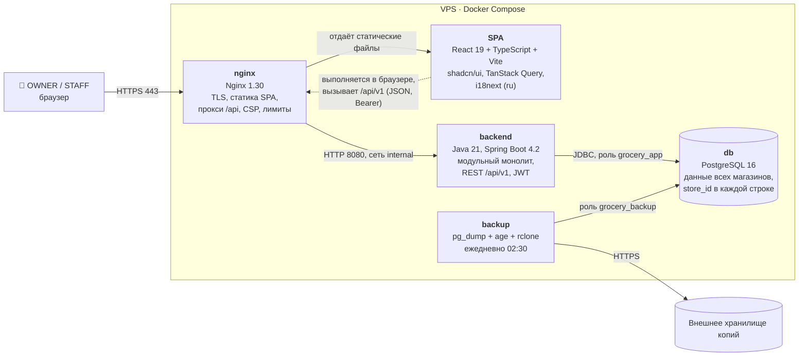

# Контейнеры (C4, уровень 2)

```mermaid
flowchart LR
    user["👤 OWNER / STAFF<br/>браузер"]

    subgraph server["VPS · Docker Compose"]
        direction LR
        nginx["<b>nginx</b><br/>Nginx 1.30<br/>TLS, статика SPA,<br/>прокси /api, CSP, лимиты"]
        spa["<b>SPA</b><br/>React 19 + TypeScript + Vite<br/>shadcn/ui, TanStack Query,<br/>i18next (ru)"]
        backend["<b>backend</b><br/>Java 21, Spring Boot 4.2<br/>модульный монолит,<br/>REST /api/v1, JWT"]
        db[("<b>db</b><br/>PostgreSQL 16<br/>данные всех магазинов,<br/>store_id в каждой строке")]
        backup["<b>backup</b><br/>pg_dump + age + rclone<br/>ежедневно 02:30"]
    end

    storage[("Внешнее хранилище копий")]

    user -- "HTTPS 443" --> nginx
    nginx -- "отдаёт статические файлы" --> spa
    spa -. "выполняется в браузере,<br/>вызывает /api/v1 (JSON, Bearer)" .-> nginx
    nginx -- "HTTP 8080, сеть internal" --> backend
    backend -- "JDBC, роль grocery_app" --> db
    backup -- "роль grocery_backup" --> db
    backup -- "HTTPS" --> storage
```
