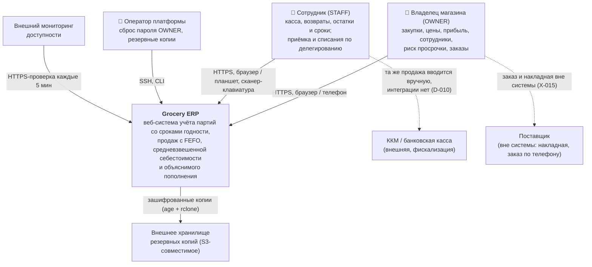

# Контекст системы (C4, уровень 1)

```mermaid
flowchart TB
    owner["👤 Владелец магазина (OWNER)<br/>закупки, цены, прибыль, сотрудники,<br/>риск просрочки, заказы"]
    staff["👤 Сотрудник (STAFF)<br/>касса, возвраты, остатки и сроки;<br/>приёмка и списания по делегированию"]
    operator["👤 Оператор платформы<br/>сброс пароля OWNER, резервные копии"]

    erp["<b>Grocery ERP</b><br/>веб-система учёта партий со сроками годности,<br/>продаж с FEFO, средневзвешенной себестоимости<br/>и объяснимого пополнения"]

    kkm["ККМ / банковская касса<br/>(внешняя, фискализация)"]
    supplier["Поставщик<br/>(вне системы: накладная, заказ по телефону)"]
    storage["Внешнее хранилище<br/>резервных копий (S3-совместимое)"]
    mon["Внешний мониторинг<br/>доступности"]

    owner -- "HTTPS, браузер / телефон" --> erp
    staff -- "HTTPS, браузер / планшет, сканер-клавиатура" --> erp
    operator -- "SSH, CLI" --> erp
    erp -- "зашифрованные копии (age + rclone)" --> storage
    mon -- "HTTPS-проверка каждые 5 мин" --> erp
    staff -. "та же продажа вводится вручную,<br/>интеграции нет (D-010)" .-> kkm
    owner -. "заказ и накладная вне системы (X-015)" .-> supplier
```

Пунктиром показаны связи, которые в MVP существуют только в реальном мире, без интеграции.
