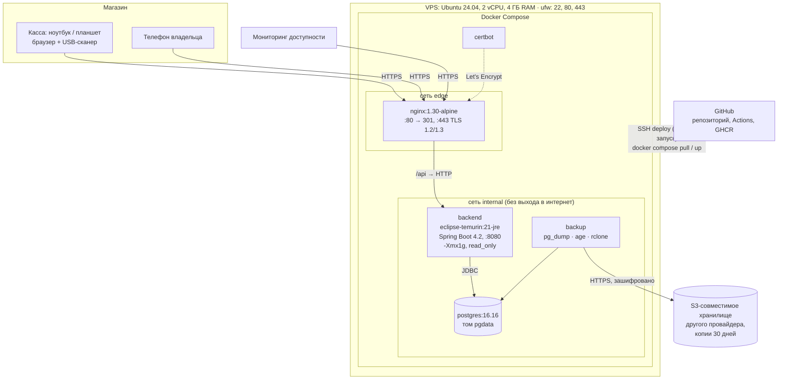
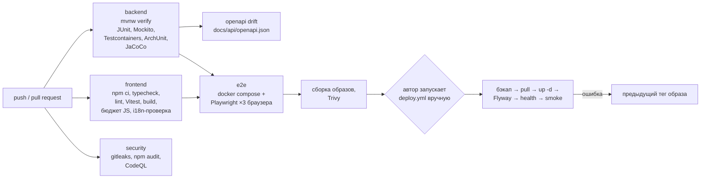

# Развёртывание и CI/CD

## Схема развёртывания пилота

```mermaid
flowchart TB
    subgraph client["Магазин"]
        pos["Касса: ноутбук / планшет<br/>браузер + USB-сканер"]
        phone["Телефон владельца"]
    end

    subgraph vps["VPS: Ubuntu 24.04, 2 vCPU, 4 ГБ RAM · ufw: 22, 80, 443"]
        subgraph compose["Docker Compose"]
            subgraph edge["сеть edge"]
                nginx["nginx:1.30-alpine<br/>:80 → 301, :443 TLS 1.2/1.3"]
            end
            subgraph internal["сеть internal (без выхода в интернет)"]
                backend["backend<br/>eclipse-temurin:21-jre<br/>Spring Boot 4.2, :8080<br/>-Xmx1g, read_only"]
                db[("postgres:16.16<br/>том pgdata")]
                backup["backup<br/>pg_dump · age · rclone"]
            end
            certbot["certbot"]
        end
    end

    s3[("S3-совместимое хранилище<br/>другого провайдера,<br/>копии 30 дней")]
    gh["GitHub<br/>репозиторий, Actions, GHCR"]
    mon["Мониторинг доступности"]

    pos -- HTTPS --> nginx
    phone -- HTTPS --> nginx
    nginx -- "/api → HTTP" --> backend
    backend -- JDBC --> db
    backup --> db
    backup -- "HTTPS, зашифровано" --> s3
    gh -- "SSH deploy (ручной запуск)<br/>docker compose pull / up" --> vps
    mon -- HTTPS --> nginx
    certbot -. "Let's Encrypt" .-> nginx
```

## Конвейер CI/CD

```mermaid
flowchart LR
    push["push / pull request"] --> be["backend<br/>mvnw verify<br/>JUnit, Mockito,<br/>Testcontainers, ArchUnit,<br/>JaCoCo"]
    push --> fe["frontend<br/>npm ci, typecheck,<br/>lint, Vitest, build,<br/>бюджет JS, i18n-проверка"]
    push --> sec["security<br/>gitleaks, npm audit,<br/>CodeQL"]
    be --> oa["openapi drift<br/>docs/api/openapi.json"]
    be --> e2e["e2e<br/>docker compose +<br/>Playwright ×3 браузера"]
    fe --> e2e
    e2e --> img["сборка образов,<br/>Trivy"]
    img --> gate{"автор запускает<br/>deploy.yml вручную"}
    gate --> deploy["бэкап → pull → up -d →<br/>Flyway → health → smoke"]
    deploy -- "ошибка" --> rollback["предыдущий тег образа"]
```
