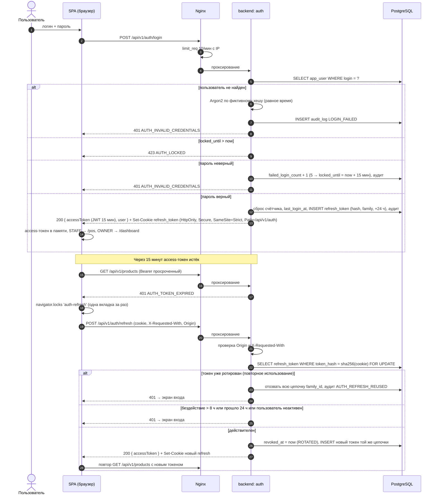

# Последовательность: аутентификация и обновление токена

```mermaid
sequenceDiagram
    autonumber
    actor U as Пользователь
    participant B as SPA (браузер)
    participant N as Nginx
    participant A as backend: auth
    participant DB as PostgreSQL

    U->>B: логин + пароль
    B->>N: POST /api/v1/auth/login
    N->>N: limit_req 10/мин с IP
    N->>A: проксирование
    A->>DB: SELECT app_user WHERE login = ?
    alt пользователь не найден
        A->>A: Argon2 по фиктивному хешу (равное время)
        A->>DB: INSERT audit_log LOGIN_FAILED
        A-->>B: 401 AUTH_INVALID_CREDENTIALS
    else locked_until > now
        A-->>B: 423 AUTH_LOCKED
    else пароль неверный
        A->>DB: failed_login_count + 1 (5 → locked_until = now + 15 мин), аудит
        A-->>B: 401 AUTH_INVALID_CREDENTIALS
    else пароль верный
        A->>DB: сброс счётчика, last_login_at, INSERT refresh_token (hash, family, +24 ч), аудит
        A-->>B: 200 { accessToken (JWT 15 мин), user } + Set-Cookie refresh_token (HttpOnly, Secure, SameSite=Strict, Path=/api/v1/auth)
        B->>B: access-токен в памяти, STAFF → /pos, OWNER → /dashboard
    end

    Note over B,A: Через 15 минут access-токен истёк
    B->>N: GET /api/v1/products (Bearer просроченный)
    N->>A: проксирование
    A-->>B: 401 AUTH_TOKEN_EXPIRED
    B->>B: navigator.locks 'auth-refresh' (одна вкладка за раз)
    B->>N: POST /api/v1/auth/refresh (cookie, X-Requested-With, Origin)
    N->>A: проксирование
    A->>A: проверка Origin и X-Requested-With
    A->>DB: SELECT refresh_token WHERE token_hash = sha256(cookie) FOR UPDATE
    alt токен уже ротирован (повторное использование)
        A->>DB: отозвать всю цепочку family_id, аудит AUTH_REFRESH_REUSED
        A-->>B: 401 → экран входа
    else бездействие > 8 ч или прошло 24 ч или пользователь неактивен
        A-->>B: 401 → экран входа
    else действителен
        A->>DB: revoked_at = now (ROTATED), INSERT новый токен той же цепочки
        A-->>B: 200 { accessToken } + Set-Cookie новый refresh
        B->>N: повтор GET /api/v1/products с новым токеном
    end
```
