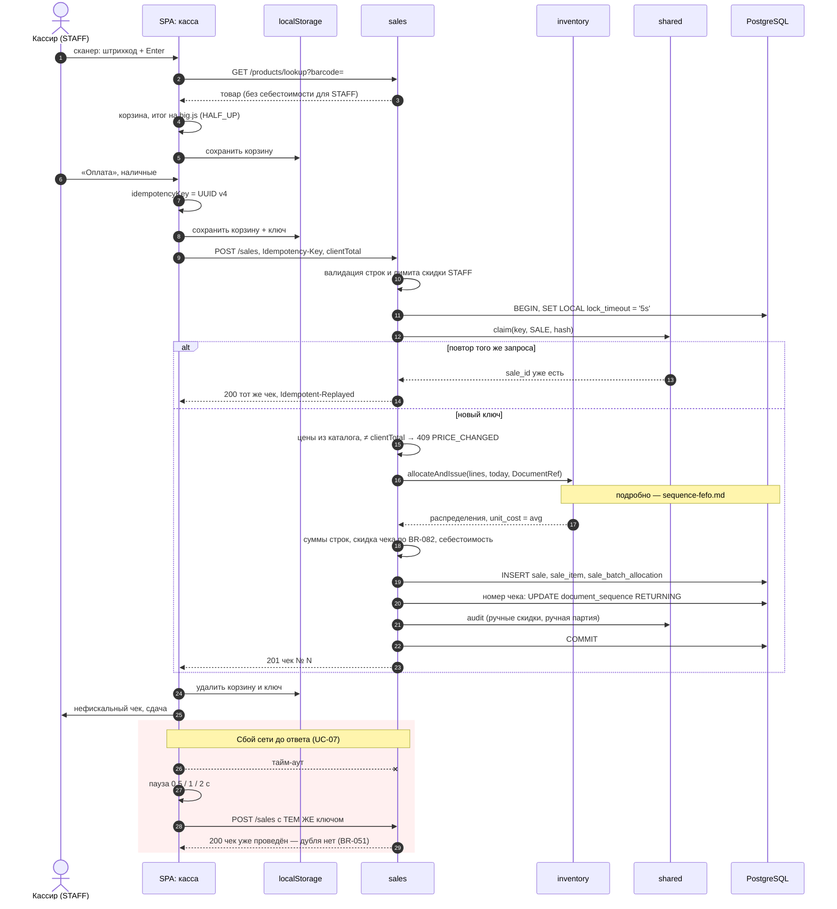

# Последовательность: продажа на кассе

```mermaid
sequenceDiagram
    autonumber
    actor C as Кассир (STAFF)
    participant B as SPA: касса
    participant LS as localStorage
    participant SL as sales
    participant I as inventory
    participant S as shared
    participant DB as PostgreSQL

    C->>B: сканер: штрихкод + Enter
    B->>SL: GET /products/lookup?barcode=
    SL-->>B: товар (без себестоимости для STAFF)
    B->>B: корзина, итог на big.js (HALF_UP)
    B->>LS: сохранить корзину
    C->>B: «Оплата», наличные
    B->>B: idempotencyKey = UUID v4
    B->>LS: сохранить корзину + ключ
    B->>SL: POST /sales, Idempotency-Key, clientTotal
    SL->>SL: валидация строк и лимита скидки STAFF
    SL->>DB: BEGIN, SET LOCAL lock_timeout = '5s'
    SL->>S: claim(key, SALE, hash)
    alt повтор того же запроса
        S-->>SL: sale_id уже есть
        SL-->>B: 200 тот же чек, Idempotent-Replayed
    else новый ключ
        SL->>SL: цены из каталога, ≠ clientTotal → 409 PRICE_CHANGED
        SL->>I: allocateAndIssue(lines, today, DocumentRef)
        Note over I,DB: подробно — sequence-fefo.md
        I-->>SL: распределения, unit_cost = avg
        SL->>SL: суммы строк, скидка чека по BR-082, себестоимость
        SL->>DB: INSERT sale, sale_item, sale_batch_allocation
        SL->>DB: номер чека: UPDATE document_sequence RETURNING
        SL->>S: audit (ручные скидки, ручная партия)
        SL->>DB: COMMIT
        SL-->>B: 201 чек № N
    end
    B->>LS: удалить корзину и ключ
    B->>C: нефискальный чек, сдача

    rect rgb(255, 240, 240)
    Note over B,SL: Сбой сети до ответа (UC-07)
    B--xSL: тайм-аут
    B->>B: пауза 0,5 / 1 / 2 с
    B->>SL: POST /sales с ТЕМ ЖЕ ключом
    SL-->>B: 200 чек уже проведён — дубля нет (BR-051)
    end
```
