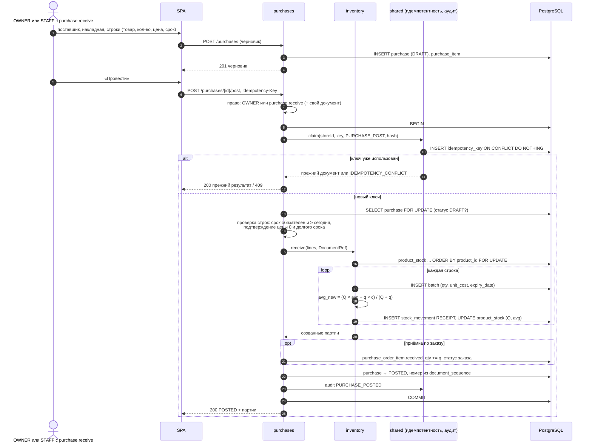

# Последовательность: приёмка поставки

```mermaid
sequenceDiagram
    autonumber
    actor U as OWNER или STAFF с purchase.receive
    participant B as SPA
    participant P as purchases
    participant I as inventory
    participant S as shared (идемпотентность, аудит)
    participant DB as PostgreSQL

    U->>B: поставщик, накладная, строки (товар, кол-во, цена, срок)
    B->>P: POST /purchases (черновик)
    P->>DB: INSERT purchase (DRAFT), purchase_item
    P-->>B: 201 черновик
    U->>B: «Провести»
    B->>P: POST /purchases/{id}/post, Idempotency-Key
    P->>P: право: OWNER или purchase.receive (+ свой документ)
    P->>DB: BEGIN
    P->>S: claim(storeId, key, PURCHASE_POST, hash)
    S->>DB: INSERT idempotency_key ON CONFLICT DO NOTHING
    alt ключ уже использован
        S-->>P: прежний документ или IDEMPOTENCY_CONFLICT
        P-->>B: 200 прежний результат / 409
    else новый ключ
        P->>DB: SELECT purchase FOR UPDATE (статус DRAFT?)
        P->>P: проверка строк: срок обязателен и ≥ сегодня,<br/>подтверждение цены 0 и долгого срока
        P->>I: receive(lines, DocumentRef)
        I->>DB: product_stock ... ORDER BY product_id FOR UPDATE
        loop каждая строка
            I->>DB: INSERT batch (qty, unit_cost, expiry_date)
            I->>I: avg_new = (Q × avg + q × c) / (Q + q)
            I->>DB: INSERT stock_movement RECEIPT, UPDATE product_stock (Q, avg)
        end
        I-->>P: созданные партии
        opt приёмка по заказу
            P->>DB: purchase_order_item.received_qty += q, статус заказа
        end
        P->>DB: purchase → POSTED, номер из document_sequence
        P->>S: audit PURCHASE_POSTED
        P->>DB: COMMIT
        P-->>B: 200 POSTED + партии
    end
```
