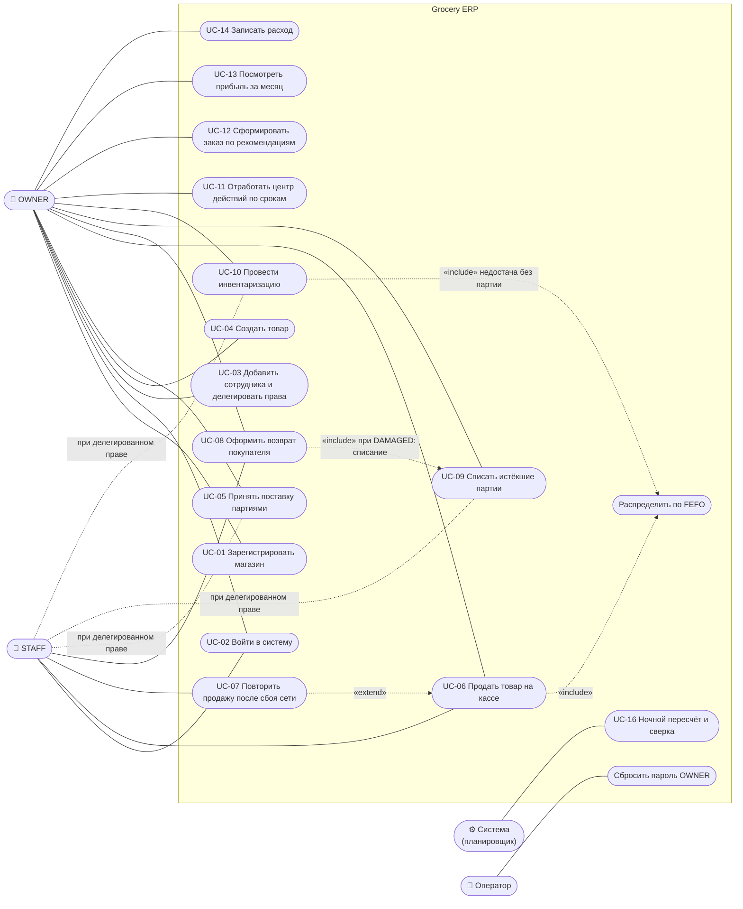

# Варианты использования

Актёры и варианты UC-01–UC-16 из `docs/USE_CASES.md`. UC-15 «Переключить язык интерфейса» отменён решением D-026 (только русский язык).

```mermaid
flowchart LR
    owner(["👤 OWNER"])
    staff(["👤 STAFF"])
    system(["⚙ Система<br/>(планировщик)"])
    operator(["👤 Оператор"])

    subgraph erp["Grocery ERP"]
        direction TB
        uc01(["UC-01 Зарегистрировать магазин"])
        uc02(["UC-02 Войти в систему"])
        uc03(["UC-03 Добавить сотрудника и делегировать права"])
        uc04(["UC-04 Создать товар"])
        uc05(["UC-05 Принять поставку партиями"])
        uc06(["UC-06 Продать товар на кассе"])
        uc07(["UC-07 Повторить продажу после сбоя сети"])
        uc08(["UC-08 Оформить возврат покупателя"])
        uc09(["UC-09 Списать истёкшие партии"])
        uc10(["UC-10 Провести инвентаризацию"])
        uc11(["UC-11 Отработать центр действий по срокам"])
        uc12(["UC-12 Сформировать заказ по рекомендациям"])
        uc13(["UC-13 Посмотреть прибыль за месяц"])
        uc14(["UC-14 Записать расход"])
        uc16(["UC-16 Ночной пересчёт и сверка"])
        ucfefo(["Распределить по FEFO"])
        ucpwd(["Сбросить пароль OWNER"])
    end

    owner --- uc01 & uc02 & uc03 & uc04 & uc05 & uc06 & uc08 & uc09 & uc10 & uc11 & uc12 & uc13 & uc14
    staff --- uc02 & uc06 & uc07 & uc08
    staff -. "при делегированном праве" .- uc05 & uc09 & uc10
    system --- uc16
    operator --- ucpwd

    uc06 -. "«include»" .-> ucfefo
    uc10 -. "«include» недостача без партии" .-> ucfefo
    uc07 -. "«extend»" .-> uc06
    uc08 -. "«include» при DAMAGED: списание" .-> uc09
```
